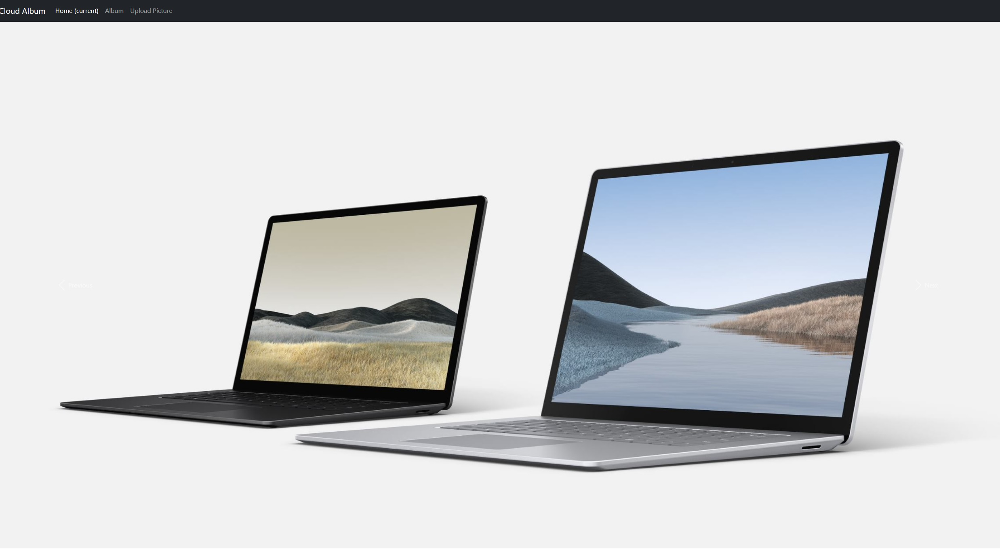
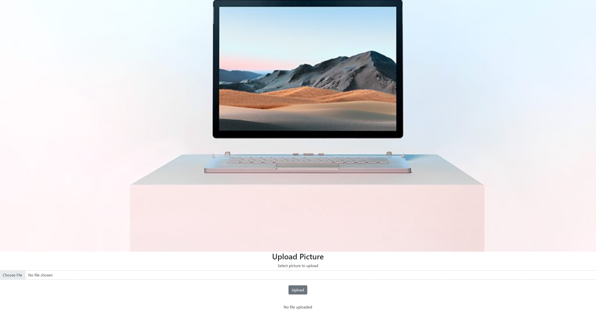

# The Cloud Album Web App with Storage

A basic album web app for displaying and uploading pictures. Uses Azure App Services web app and Storage account.

## Getting Started

### Prerequisites
- .NET 7.0 or above. [Download](https://dotnet.microsoft.com/download)
- Azure CLI. [Install](https://docs.microsoft.com/cli/azure/install-azure-cli)


### Quickstart

1. login to your Azure subscription
    ```
    az login
    az account set --s {Azure_subscription_ID}
    ```

2. clone this repository and change the working directory to this project folder.
    ```
    git clone https://github.com/Azure-Samples/changeanalysis-webapp-storage-sample.git
    cd changeanalysis-webapp-storage-sample
    ```

3. Create and deploy the web app. Take a note of the resource group created if you want to deploy your storage account there too
    ```
    az webapp up --name {webapp_name} --sku S2 --location eastus
    ```

4. Create storage account
    ```
    az storage account create --name {storage_name} --resource-group {resourcegroup_name} --sku Standard_RAGRS --https-only
    ```

5. Show storage account connection string
    ```
    az storage account show-connection-string -g {resourcegroup_name} -n {storage_name}
    ```

6. Connect web app to storage account through App Settings
    ```
    az webapp config appsettings set -g {resourcegroup_name} -n {webapp_name} --settings AzureStorageConnection={storage_connectionstring_from_previous_step}
    ```


## Demo

Launch your web app. You can see a carousel of images displaying slide shows similar to the following:



Click on **Upload Picture** on to the navigation bar. Upload your own picture and see it displaying in the album.



## Clean up

Delete the resource group

    
    az group delete -n {resourcegroup_name}
    

